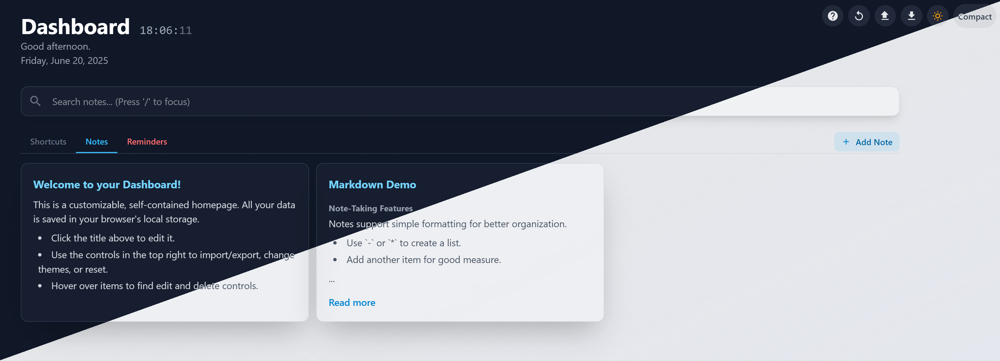

# My Quick Links Homepage

A simple, customizable homepage for quick access to your links and notes. All settings are right in the `homepage.html` file, making it super easy to use and deploy.

## Features

* **Quick Links:** Organize your favorite websites by category with custom names, links, and icons.
* **Notes:** Keep important thoughts and lists directly on your homepage. Supports basic headings.
* **Theme Switcher:** Go between **light** and **dark** mode.
* **Display Styles:** Choose between a **"Comfortable"** spacious view and a **"Compact"** view for more content.
* **Self-Contained:** No separate JavaScript files needed. Everything is in `homepage.html`.
* **Modern Design:** Built with Tailwind CSS for a clean look.

---

## Deployment

To use your homepage, just copy these two files to your web server or computer:

* `homepage.html`
* `style.css`

Then, open `homepage.html` in your web browser. That's it!

---

## User Guide: Make It Yours!

All customization happens inside the `homepage.html` file, within the `<script>` section at the very top. Look for the `configJson` settings.

### Customizing Your Page

You'll edit the `configJson` area in `homepage.html`.



* **Page Title:**
    Find `"pageTitle": "My Quick Links",` and change `"My Quick Links"` to whatever you want your page title to be.

* **Quick Links (Shortcuts):**
    Find the `"shortcuts": [` section.
    * **Add:** Add a new line like this:
        ```json
        { "name": "Google", "category": "Search", "url": "[https://www.google.com](https://www.google.com)", "icon": "google" },
        ```
        Change `name`, `category`, `url`, and `icon` as needed.
    * **Edit:** Change any detail for an existing shortcut.
    * **Remove:** Delete the entire `{ ... },` line for a shortcut.
    * **Icons:** Use names like `"google"`, `"youtube"`, `"github"`. You can add your own (see "Custom Icons" below).

* **Category Colors:**
    Find the `"categoryConfig": {` section.
    * Add or change colors for your categories here. For example, `"Search": { "color": "sky" },`.
    * Use any [Tailwind CSS color name](https://tailwindcss.com/docs/customizing-colors) (e.g., `sky`, `red`, `violet`).

* **Notes:**
    Find the `"notes": [` section.
    * **Add:** Add a new note:
        ```json
        { "title": "My Note", "content": "#Groceries#\nMilk\nBread" },
        ```
        `title` is optional.
    * **Content:** Write your note content. Use `#Header#` or `##Subheader##` for headings. Empty lines create new paragraphs.
    * **Edit/Remove:** Change or delete existing note entries.

### Interacting with the Page

* **Quick Links:** Click any link to open it in a new tab.
* **Notes:** If a note is too long, click its card to open a pop-up with the full text. Close it with `X`, by clicking outside the note, or by pressing `Escape`.
* **Theme Switcher:** Click the sun/moon icon (top right) to toggle light/dark mode. The page remembers your choice.
* **Display Style:** Click the "Compact"/"Comfortable" button (top right) to change the page layout. This also remembers your choice.

### Custom Icons

Want to use your own icons for shortcuts?

* Find the `"icons": {` section in `configJson`.
* Add a new entry like `"my_icon_name": "YOUR_SVG_PATH_DATA"`.
* You can get SVG path data from places like [Material Design Icons](https://materialdesignicons.com/). Just copy the `d="..."` part.
* Then use `"icon": "my_icon_name"` in your shortcut entry.

---

## Development (For CSS Customization)

This section is only if you want to change the visual styling (CSS) of the homepage.

### What you need

* Node.js

### How to set up

1.  **Install Tailwind CSS:**
    Open your terminal in the project folder and run:
    ```bash
    npm install tailwindcss @tailwindcss/cli
    ```

2.  **Start Tailwind CSS Watcher:**
    Keep this command running while you edit `homepage.html` or `input.css`. It will automatically update `style.css`.
    ```bash
    npx tailwindcss -i ./input.css -o ./style.css --watch
    ```
    * `input.css`: This is where Tailwind gets its styles from.
    * `style.css`: This is the final CSS file used by `homepage.html`.

**Note:** Most styling is done directly in `homepage.html` using Tailwind classes.