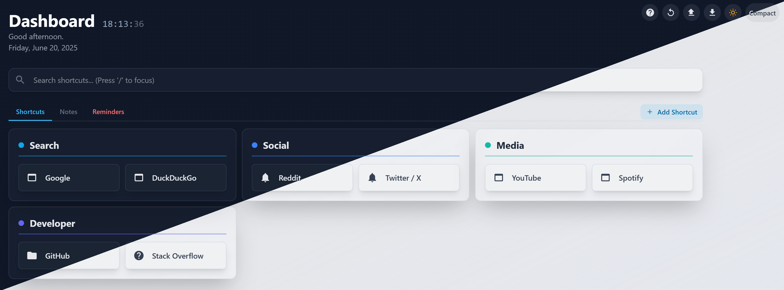

# A Modern, Self-Contained Homepage

A fast, modern, and highly customizable homepage that runs entirely from a single HTML file. No databases, no complicated setup. Organize your links, manage notes, and keep track of reminders with an intuitive interface. All your data is securely stored in your browser's local storage.




## Table of Contents

- [Features](#features)
- [Live Demo](#live-demo)
- [Getting Started](#getting-started)
- [How to Use the Homepage](#how-to-use-the-homepage)
  - [Editing Content](#editing-content)
  - [Customizing the View](#customizing-the-view)
  - [Managing Your Data](#managing-your-data)
- [Development](#development)

## Features

* **Zero-Dependency Deployment:** Works out of the box from a single `homepage.html` and `style.css` file.
* **Interactive On-Page Editing:** No more manual JSON editing. Add, edit, and delete items directly through a user-friendly interface.
* **Organized Shortcuts:** Group your favorite links into customizable categories, each with a unique color and icon.
* **Rich Note-Taking:** A dedicated notes tab that supports Markdown-like syntax for headers and lists.
* **Powerful Reminders:** Set one-time or complex recurring reminders (daily, weekly, monthly) with specific end conditions.
* **Data Portability:** Easily import and export your entire configuration as a JSON file or a clipboard string.
* **Customizable UI:**
    * Switch between **Light** and **Dark** themes.
    * Toggle between **Comfortable** and **Compact** display styles to fit more on the screen.
* **Self-Contained & Private:** Everything is stored in your browser's local storage. Your data stays with you.

## Getting Started

Using this homepage is as simple as it gets.

1.  Download the `homepage.html` and `style.css` files.
2.  Place them in a folder on your computer or on any web server.
3.  Open `homepage.html` in your web browser.

That's it! The page will load with a default set of example items that you can start customizing immediately.

## How to Use the Homepage

All configuration is done directly on the page.

### Editing Content

* **Page Title:** The main title at the top of the page ("Dashboard") is editable. Just click on it, type your new title, and click away.

* **Adding Items:** Use the "Add Shortcut", "Add Note", or "Add Reminder" button located at the top right of each tab to create a new item.

* **Editing & Deleting:** Hover your mouse over any shortcut, note, or reminder card. Edit (`✎`) and Delete (`🗑️`) icons will appear in the top-right corner of the card.

*Caption: Editing a shortcut using the on-page modal.*

* **Managing Categories:**
    * When adding or editing a shortcut, you can assign it to a category.
    * To add a new category, click the "+ New" button in the category selector.
    * To edit or delete an existing category, hover over its name in the category selector to reveal controls.

### Customizing the View

Use the icons in the absolute top-right corner of the page to customize your experience.

* **Theme Switcher (☀️/🌙):** Instantly toggle between light and dark modes.
* **Style Switcher (Compact/Comfortable):** Change the layout density. "Compact" is great for smaller screens or showing more information at once.

Your theme and style preferences are automatically saved in your browser.

### Managing Your Data

You have full control over your configuration. Use the menu icons in the top-right corner to manage your setup.

*Caption: Easily import or export your configuration.*

* **Export (⬇️):** Save your current setup (all shortcuts, notes, and reminders) to a JSON file or copy it to your clipboard. This is perfect for making backups or moving to a new computer.
* **Import (⬆️):** Load a configuration from a JSON file or a string you've previously exported.
* **Reset (🔄):** This will completely wipe your current configuration and restore the page to its original default settings. **Use with caution!**

## Development

This section is for users who want to make significant changes to the visual style of the page by modifying the underlying CSS.

#### Prerequisites

* You must have **Node.js** and **npm** installed.

#### Setup

1.  **Install Dependencies:**
    Open a terminal in the project's root directory and run the following command to install Tailwind CSS:
    ```bash
    npm install tailwindcss
    ```

2.  **Start the Tailwind Watcher:**
    Run this command in your terminal. It will watch for any changes you make to the class names in `homepage.html` and automatically rebuild the `style.css` file.
    ```bash
    npx tailwindcss -i ./input.css -o ./style.css --watch
    ```
    Keep this process running while you are making style edits.